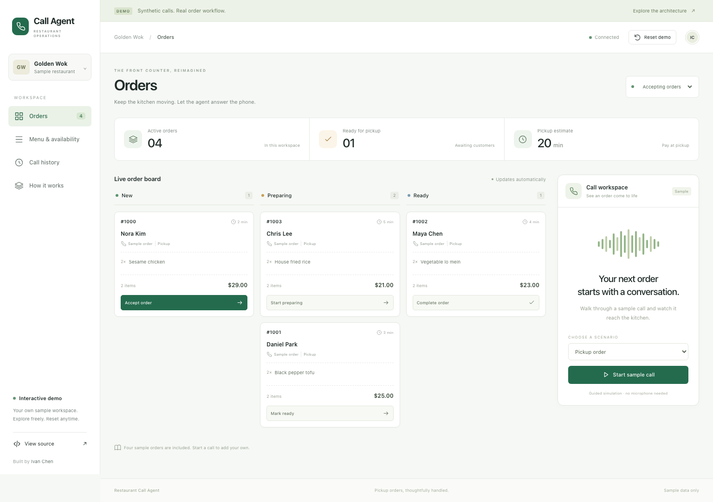
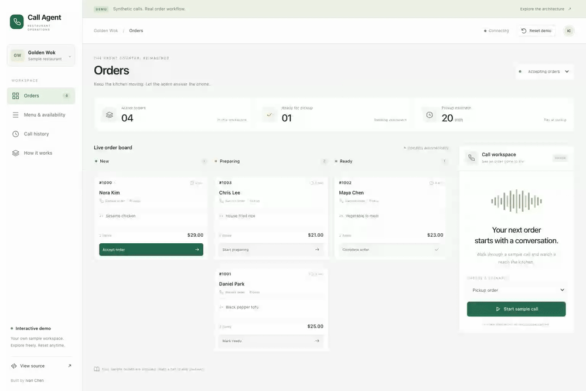
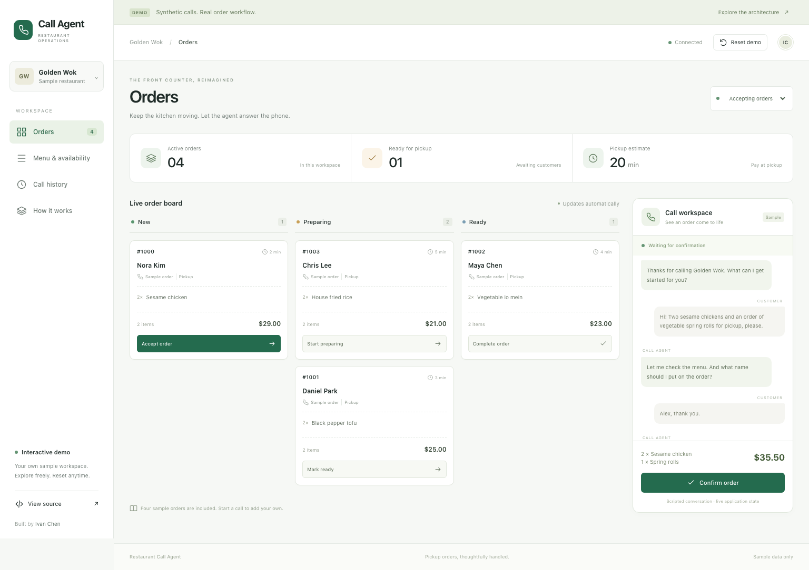
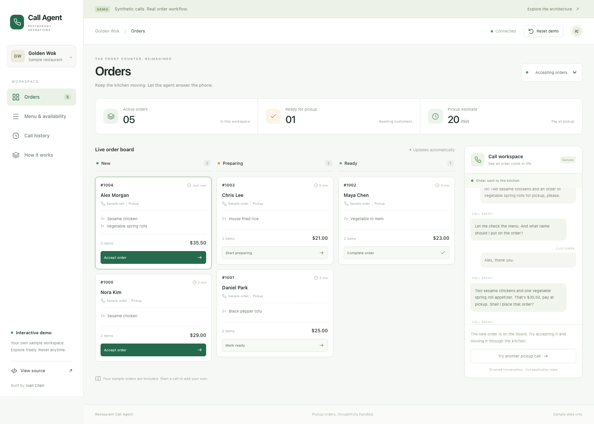
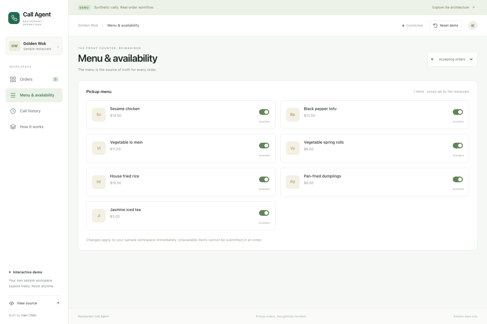
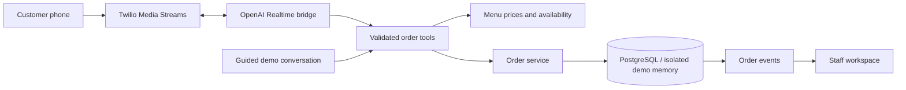

<div align="center">

# Restaurant Call Agent

**From a phone conversation to a kitchen-ready pickup order.**

A restaurant ordering workspace with a voice-agent integration, menu validation, and a real-time staff dashboard.

[Try it locally](#try-the-product) · [Watch the walkthrough](#walkthrough) · [Architecture](docs/ARCHITECTURE.md) · [Deployment](docs/DEPLOYMENT.md)

</div>



## Why I built it

Taking phone orders interrupts the counter and the kitchen, especially during a rush. I saw this in my parents’ restaurant and wanted to build a better handoff: let an agent handle the conversation, validate the order against the menu, and give staff a clear queue they can act on.

This repository includes the voice integration and a self-contained product demo. The demo uses scripted calls and synthetic customers, so anyone can explore the workflow without a phone number or API keys.

## Try the product

### One command with Docker

```bash
docker compose -f compose.demo.yml up --build
```

Open **[localhost:4173](http://localhost:4173)**. No accounts, secrets, or database setup required.

### Run with Node.js 22

```bash
npm ci
npm --prefix apps/staff-web ci
npm run demo:build
npm run demo
```

Open **[localhost:4173](http://localhost:4173)**.

### A two-minute tour

1. **Start a sample call.** Choose a pickup order and advance the conversation, or use “Play call.”
2. **Confirm the order.** The backend checks menu availability and prices, then adds the order to the board.
3. **Run the kitchen.** Accept the order, start preparation, mark it ready, and complete it.
4. **Try an exception.** Choose an unavailable item or a request to speak with staff; inspect the recorded handoff.
5. **Explore the controls.** Change menu availability, set the restaurant to busy or closed, or open an order’s event timeline.

Every visitor gets a separate, temporary workspace. “Reset demo” restores the sample data. Conversations are simulated; order creation, validation, status transitions, session isolation, and event delivery run on the server.

## Walkthrough



[Download the silent video](docs/images/walkthrough.webm) · Recorded from the running application.

## The workspace

| Orders | Calls | Restaurant controls |
| --- | --- | --- |
| New → preparing → ready → completed | Guided pickup, unavailable-item, and human-handoff scenarios | Menu availability, open/busy/closed status, and pickup estimates |
| Itemized receipts and order timelines | Explicit confirmation before submission | Prices calculated from the restaurant menu |
| Automatic updates with polling fallback | Retry-safe order creation | Responsive desktop and mobile layouts |

<details>
<summary><strong>See the call-to-order workflow</strong></summary>





</details>

<details>
<summary><strong>See menu availability controls</strong></summary>



</details>

## How it works



**The model does not decide prices.** Order tools submit item IDs and quantities; server-side menu data determines availability and totals.

**Retries should not become extra orders.** Voice orders use a stable per-call identity. The repositories enforce idempotency, and the regression suite checks that repeated submissions produce one order and one creation event.

**Staff control the workflow.** Allowed status transitions live in the repository layer. Each change leaves an event trail. The existing staff application supports WebSocket delivery and replay; the isolated demo uses server-sent events with a polling fallback.

**The demo is isolated by construction.** It creates an in-memory repository per visitor and never connects to Twilio, OpenAI, or a production database. Sessions expire after 30 minutes and server capacity is bounded.

[Read the architecture and tradeoffs →](docs/ARCHITECTURE.md)

## Stack

| Layer | Technology |
| --- | --- |
| Voice integration | Twilio, OpenAI Realtime, audio conversion |
| Backend | Node.js 22, TypeScript, Express, Zod |
| Staff UI | React, Vite, TypeScript |
| Persistence | PostgreSQL, repository abstraction, order events and outbox |
| Checks | Vitest, Supertest, Playwright, GitHub Actions |
| Packaging | Docker multi-stage builds and Compose |

## Verification

```bash
npm run ci                 # lint, backend types/tests/build, staff types/tests/build
npm run demo:test:e2e       # browser workflow tests; build the demo first
npm run test:integration    # requires an isolated disposable PostgreSQL database
```

Install the browser once with `npm --prefix apps/staff-web exec playwright install chromium`.

The test suite covers order retries, menu validation, staff transitions, session isolation/expiry, and browser workflows. PostgreSQL integration and the demo container have also been exercised locally. See the [dated verification report](docs/VERIFICATION.md) for exact results and boundaries.

## Deployment modes

| Mode | What is included | What you configure |
| --- | --- | --- |
| **Product demo** | Complete UI, isolated synthetic workspaces, shared order logic, event stream | One container; HTTPS/reverse proxy for a public host |
| **Voice integration** | Twilio endpoints, audio bridge, model tools, staff API, PostgreSQL/outbox path | Provider accounts, phone routing, secrets, database, staff credentials, and live-call validation |

The product demo is packaged for deployment. The provider-backed phone integration is a separate path and has **not been validated end to end in this release**. Do not route customer calls to it based on the demo checks alone. The demo’s handoff records an event; it does not place a real transfer.

[Deployment guide →](docs/DEPLOYMENT.md) · [Environment template](.env.example)

## Repository map

```text
src/demo/                 Isolated demo sessions, API, and server
src/workers/call-*.ts      Voice session, audio bridge, prompt, and tools
src/menuOrder.ts           Shared menu validation and price calculation
src/orderService.ts        Order operations
src/store/                 Memory and PostgreSQL repositories
apps/staff-web/src/demo/   Product demonstration workspace
apps/staff-web/src/App.tsx Original authenticated staff application
tests/                    Backend and database checks
apps/staff-web/e2e/        Browser workflows
docs/                     Architecture, deployment, and verification
```

Built by [Ivan Chen](https://github.com/ichen27). See [CONTRIBUTING.md](CONTRIBUTING.md) for development instructions.
